# Dossier architecture

Dossier is a Bun workspace built around one Cloudflare Worker. The Worker
publishes versioned HTML documents, reusable assets, and a TanStack Start
management application. Effect owns the HTTP and service boundary, D1 stores
metadata, and R2 stores immutable document and asset bytes.

## Repository layout

```text
apps/web/               TanStack Start app and custom Worker entry
  src/worker.ts         Routes API, document, asset, and auth requests
  src/api/              Effect API handlers, serving routes, and the wrapper
  src/services/         Publish, State, access, tree, asset, and session logic
  src/runtime/          Frame and wrapper scripts for saved values
  src/db/               Drizzle schema and database queries
  src/routes/           Dashboard, hub, auth, and workspace pages
  src/components/       React and shadcn components
  src/styles/           Design tokens and application styles
  public/fonts/         Bundled WOFF2 fonts
  drizzle/              Generated D1 migrations
  test/                 Vitest suites running under workerd
packages/policy/        Runtime-neutral HTML and CSS policy
packages/contracts/     Shared Effect Schema API contracts
packages/cli/           Public @agent964/dossier command-line client
docs/                   Architecture, CLI reference, and production runbook
```

Effect `HttpApi` declares the API once. The Worker turns it into a fetch
handler, while the CLI derives a typed client from the same contract. Effect
services receive D1, R2, rate limiting, configuration, and clock dependencies
through layers, which lets tests substitute implementations without mocking
Worker globals.

TanStack Start renders the dashboard, document hubs, CLI authentication, and
workspace settings. Its loaders call the same services in-process. The custom
Worker entry routes `/api`, `/d`, `/a`, and `/auth` before handing remaining
requests to TanStack Start.

Ordinary document serving never transforms stored bytes. The Worker streams the
R2 body and adds the serving headers. A saved-values document opens in a
first-party wrapper instead. Its frame route reads the stored bytes and prepends
the frame runtime when that version declares saved fields. The stored R2 object
remains unchanged.

Bun runs workspace scripts and builds the CLI, but the published CLI remains
compatible with Node 22.12 or newer. Worker tests use workerd because Bun does
not emulate D1, R2, or Worker bindings.

## Data model


Workspaces own documents and assets. Accounts join workspaces through
memberships, authenticate through identities or API keys, and author documents.
Each document points at its current immutable version and may have a parent,
visibility boundary, shares, deletion batch, disabled timestamp, or saved-values
setting. A saved-values version stores its field manifest in
`document_versions.state_fields_json`. Assets also have immutable numbered
versions.

Four document-local tables hold saved-values data and authority.

- `document_state` stores the shared revision, last saved time, and total saved bytes.
- `document_state_fields` stores one saved row per field name with its type, JSON value, per-field revision, actor, and update time. Authored defaults remain in the version manifest until a person saves that field.
- `document_state_grants` stores an email and its `can_save` value for one document. Access matches the row only to a verified identity.
- `document_edit_links` stores one generation and revocation record per document. The Worker derives the URL token from the document ID, generation, and `LINK_SECRET`.

The Worker materializes document ancestry as a bounded path with a maximum
depth of 16. All mutations preserve workspace ownership, prevent cycles, and
update parent, path, and depth together. A document may have a different author
from its parent. Tree organization does not transfer editorship.

## Access boundary

For a document, the effective boundary is the first node at or above it with an
explicit `visibility`. That node supplies both visibility and shares. If no node
sets visibility, the fallback is `team` with no invited addresses.

An explicit boundary replaces its inherited boundary rather than merging with
it. Clearing visibility to inherit also deletes that node's shares. Only a
view-share delta with nonempty `add` or `remove` entries materializes inherited
access. The `Shares` service copies the effective visibility and invite list to
the inheriting node before applying those entries. Grant-only deltas
(`addSavers`, `removeSavers`, or `removeGrants`) leave visibility and inherited
view shares unchanged. Both kinds of delta increment the document revision.

A row in `document_state_grants` applies only to its document. A verified
account with that email can read the document. A row with `can_save = 1` also
allows saved-value changes. Removing save access sets `can_save = 0`, so the
person keeps document-local read access. A share delta can delete the row with
`removeGrants` when it removes view access.

Hierarchy is organizational, not confidential. A public child beneath a
private parent appears as a virtual root without exposing the parent. Access is
also document-wide. The current effective boundary governs every retained
version, including pinned version URLs.

`private` permits the author, workspace administrators, and invited verified
email addresses. `team` additionally permits workspace members. `public`
permits anonymous document serving.

## Read and write rules

A viewer can read content only when the target node itself is neither deleted
nor disabled and at least one condition holds.

- The viewer is an editor of the document.
- The effective visibility is `public`.
- The visibility is `team` and the viewer belongs to the workspace.
- A verified viewer email is in the effective invite list.
- A verified viewer email has a grant in `document_state_grants`.

An active edit link uses a separate browser-only read rule for one saved-values
document. It never adds the document to list or tree results.

Ancestor deletion and disable state do not make a live child unavailable.
Ancestors contribute only the access boundary. List and tree queries apply the
account access predicate before pagination.

Editor management is separate from content reading. Detail, trash, restore,
enable, and share operations authorize editorship and the requested state
transition directly. Deleted or disabled content still serves as 404, including
to an editor.

Saved-value writes use a separate document-local rule. The document author and
workspace administrators can save. A signed-in account can save when a verified
email matches a `document_state_grants` row whose `can_save` value is `1`. An
anonymous browser can save while its edit-link generation remains active. A
grant or edit link never makes the actor an editor and never permits publishing,
sharing, or access to another document.

## Saved-values browser routes

The canonical `/d/<id>` route renders the first-party wrapper for a saved-values
document. `/d/<id>/v/<n>` renders the same wrapper in read-only mode. Ordinary
documents continue through the byte-preserving serving service.

The wrapper owns Save, status text, retry behavior, and conflict recovery. It
loads the current snapshot before it reveals the frame. It keeps a draft in the
frame when a save fails, a saved field conflicts, the HTML version changes, or
access ends. It does not save automatically. Another visitor sees a completed
save after reloading the document or completing a later save.

The `State` service owns snapshot reads, guarded saves, frame tickets, edit-token
verification, and edit-link creation, retrieval, and revocation. The `Shares`
service writes signed-in saved-values grants. Both the Bearer API handlers under
`/api/documents/:id/state` and the browser handlers call `State`.

The browser routes divide the work as follows.

- `GET /d/<id>/state` returns the snapshot, saving permission, frame metadata, and a CSRF token for a signed-in account. It accepts a cookie session, an `X-Dossier-Edit-Token` header, or an anonymous read of a public document.
- `POST /d/<id>/state` saves changed fields. A signed-in request sends the cookie and `X-Dossier-Csrf`. An edit-link request sends `X-Dossier-Edit-Token` without cookies.
- `GET /d/<id>/frame?t=<ticket>` serves the current stored HTML inside the wrapper. The pinned form uses `/d/<id>/v/<n>/frame`. The route prepends `frame-runtime.js` when the version has a field manifest.
- `GET /d/<id>/edit#<token>` opens the wrapper for an anonymous edit link. The fragment never reaches the Worker. The wrapper moves it into the edit-token request header.

A frame ticket lasts 60 seconds and binds the document, workspace, version, and
viewer. The frame route verifies the ticket, checks current document access or
link revocation, and then reads the matching R2 object. The ticket gives the
frame no API credential. The sandbox CSP keeps `connect-src 'none'`, while the
frame runtime and wrapper runtime exchange field messages with `postMessage`.
The frame runtime applies saved values to marked controls and supports custom
controls through `window.dossierState.register`. The wrapper alone sends state
requests.

## HTTP error contract

The protected `/api/*` routes require a Bearer API key. They return
`401 unauthenticated` for a missing or invalid key, `404 not_found` for an
unreadable document, and `403 editor_required` when the operation needs document
management permission.

The ordinary document, raw, and hub routes under `/d/<id>` accept anonymous
access, a cookie session, or a Bearer key under the document read rule. A
supplied Bearer key that the Worker rejects returns `401 unauthenticated` on
those routes. The saved-values wrapper for `/d/<id>` and `/d/<id>/v/<n>` reads
only the cookie session, serves a public document anonymously, and returns a
404 page when the viewer cannot read the document. `/d/<id>/edit` serves the
link shell. The shell then checks access through `GET /d/<id>/state`, whose
failures are JSON responses.

`GET /d/<id>/state` accepts a cookie session, an active edit token, or anonymous
public access. `POST /d/<id>/state` requires either a cookie session with a valid
CSRF header or an active edit token. It returns `403 state_edit_required` when
the actor cannot save. An invalid or revoked edit token returns
`410 link_revoked`. The frame route requires its short-lived ticket and usually
returns a 404 page when verification or access fails. It returns
`410 link_revoked` when a ticket names a revoked link generation.

Asset routes under `/a/*` remain public by URL and return 404 for a missing
asset. API 401 responses include `WWW-Authenticate: Bearer`. Other stable API
codes include `403 publisher_required`, `409 has_children`, `409 slug_taken`,
`409 conflict`, `409 idempotency_conflict`, 413 for oversized bodies, 422 for
policy rejection, and 429 with `Retry-After`. Anonymous API requests remain 401
even for public documents. Anonymous content reads use `/d`.

## Delete, restore, and disable


Deleting a document selects that node and every live descendant, regardless of
author. A multi-node deletion requires `force=1`. Without it, the API returns
409 `has_children` with document and distinct-author counts.

A fixed-size D1 batch creates a deletion-batch record and marks the selected
rows with its ID and deletion time. Descendants already in trash keep their
earlier batch. Every affected author can see their archived documents in trash.

Restore accepts a batch ID and restores exactly the rows that still carry that
batch ID. Only an editor of the batch root may restore it. The service refuses
restore while the root's current parent has a deletion timestamp. Repeated
delete and restore cycles create distinct batches. The service does not
support partial restore.

Disable and enable affect one node only. A disabled node serves 404 to everyone
but remains visible to its editors in management views. Dossier keeps R2
objects while documents remain restorable.

A batch stays restorable for the configured retention window (30 days by
default, `PURGE_RETENTION_DAYS`). After that window it becomes eligible for
permanent removal. Each deployment runs the purge once a week (Sunday 03:17
UTC) from a cron trigger, so eligible batches disappear without an operator
command. An operator can also run `dossier admin purge --execute` sooner. The
command is a dry run without the flag. Either path removes one batch at a time
under a short lease.
The purge deletes R2 objects first, in chunks, checkpointing as it goes, then
deletes the version and document rows, so a crash leaves objects gone and rows
intact and the next run finishes the job. The purge keeps the deletion batch
row as an audit record of who archived what and when the purge removed it.
Restore refuses a batch once the purge has claimed it.

## Upload policy and serving CSP

`packages/policy` applies the same static HTML and CSS rules in the Worker and
CLI. Server configuration remains authoritative for size limits and host
allowlists.

The HTML policy rejects forms, objects, embeds, applets, base elements,
event-handler attributes, `srcdoc`, meta refresh, unsafe URL schemes, excessive
nesting, and non-classic scripts. It limits iframes to same-origin `/d/...` URLs
or the embed allowlist. External scripts require an allowed host and integrity
hash. External stylesheets require an allowed host. The policy allows inline
classic scripts.

The policy measures HTML size in UTF-8 bytes and rejects lone surrogates.
Dossier preserves byte order marks and line endings.

The policy parses CSS with css-tree across style elements, attributes, and
uploaded CSS. It inspects URLs, imports, image sets, and custom properties,
decodes escaped function names, rejects legacy executable constructs and unsafe
URL schemes, and fails closed on suspicious parser recovery nodes. External URLs
must use HTTPS on the configured allowlist or point to `/a/...`.

The Worker sends this CSP with document responses and appends configured hosts
to the relevant directives.

```text
default-src 'none';
script-src 'unsafe-inline' <SCRIPT_HOST_ALLOWLIST>;
script-src-attr 'none';
style-src 'unsafe-inline' <PUBLIC_BASE_URL> <STYLE_HOST_ALLOWLIST>;
font-src <PUBLIC_BASE_URL> <STYLE_HOST_ALLOWLIST>;
img-src https: data:;
connect-src 'none'; worker-src 'none';
frame-src <PUBLIC_BASE_URL> <EMBED_HOST_ALLOWLIST>;
object-src 'none'; base-uri 'none'; form-action 'none';
sandbox allow-scripts allow-popups allow-popups-to-escape-sandbox
```

The first-party origin comes from `PUBLIC_BASE_URL`. Style, embed, and script
hosts come from their respective Worker allowlist variables.

## Cloudflare Workers specifics

`apps/web/wrangler.jsonc` defines the custom server entry, Node compatibility,
production custom domain, Vite assets, D1 database, R2 bucket, upload and state
rate limiters, public configuration, and the corresponding development
environment. `STATE_RATE_LIMITER` allows 60 requests per 60 seconds. When a
deployed environment lacks the binding, the API state read and write routes,
every browser save, and every signed-in or edit-link browser read refuse the
request with `503 state_unavailable` rather than skipping the limit. Anonymous
browser reads of a public document's values and the API link create, get, and
revoke routes do not use the limiter, so they keep working without the
binding. The missing binding also removes `state` from `/api/healthz`, so the
CLI refuses its state commands before sending them.
Set secrets with `wrangler secret put`. They override same-named variables.
`LINK_SECRET` signs anonymous edit links and must differ between environments.

Drizzle generates migrations into `apps/web/drizzle`. Apply them with Wrangler
D1 migration commands for local, development, or production targets. Runtime
multi-statement writes use `db.batch()` rather than transaction callbacks.

Vitest uses the Cloudflare plugin, applies D1 migrations in setup, and isolates
storage per test file. Browser probes exercise Chromium and WebKit against a
Wrangler development server. Deployment bootstrap uses the protected setup
endpoint through the `dossier setup` flow.

## Provenance

Dossier descends from postplan 0.0.4, released under the MIT License. The
read-only reference copy remains available in repository history at commit
`5be3f93`. The current code adapts or rewrites that copy for the architecture
above.
