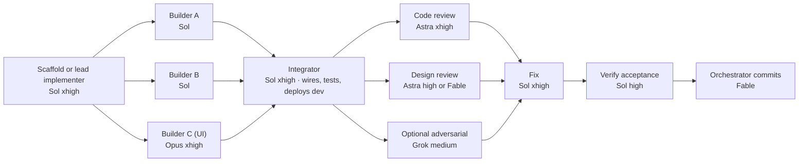

# How each dossier phase is built

Every phase of `docs/PLAN.md` section 13 runs as one Workflow with the same shape. Models are chosen per seat from the fleet table in the user's global instructions.

Seat rules:
- **Implementation against the approved plan**: gpt-5.6-sol at xhigh (deep codebase work, cost-efficient). Sol at high for narrower builders.
- **Visual implementation with design freedom** (dashboard, hub, landing): claude-opus-5 at xhigh, with the agent964 DESIGN.md as the system.
- **Primary independent review** must cross vendors: gpt-6-astra reviews Sol and Opus work. A Fable or Opus reviewer is used when the work under review is mostly Astra or Sol output.
- **Design-taste review**: gpt-6-astra at high for fidelity checks against tokens; claude-fable-5-1 at high when judging whether a page is world-class.
- **Grok** only as an extra adversarial reviewer, never the primary one.
- **Orchestrator** (Fable): writes the workflow, reads every report, commits once per phase, updates `docs/PLAN.md` status.

Guard rails baked into every prompt: no commits by agents, no production Cloudflare resources before phase 4, exact pinned versions, report only what was run, parallel builders own disjoint directories and never edit `package.json`.

Phase acceptance is the `verify` agent's PASS/FAIL list against PLAN section 13, plus the orchestrator re-running `bun run test` and `bun run typecheck` before committing.
