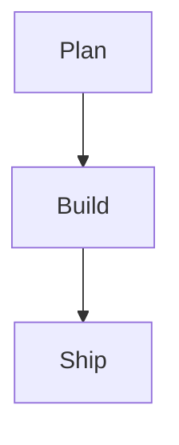

# Code and diagrams


```mermaid
graph TD
  Plan --> Build
  Build --> Ship
```

```ts
const trucks = 12 * 2
console.log(`${trucks} trucks`)
```

```
plain block
```

Inline math $x_1^2 + y^2$ sits in the line.

$$
\int_0^1 x\,dx = \frac{1}{2}
$$
